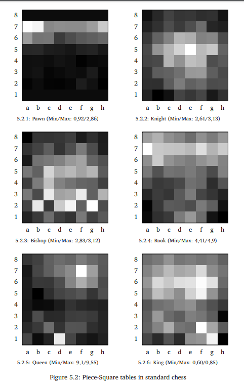
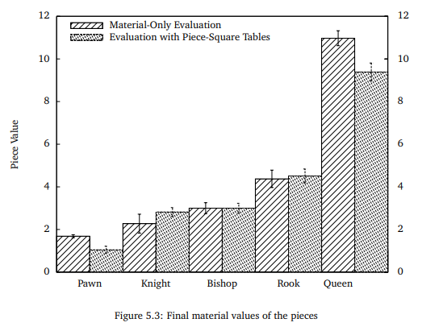

﷽

Estimation Functions for Chess Game

Work done by **CHEBBAH Mehdi** and **HAMMAS Ali Cherif**

---

# Table of Contents

[TOC]

---

# Introduction

All past and present chess programs are inspired by a paper published by **Claude Shannon** entitled *'Programming a Computer for Playing Chess'* . Shannon presents his **MINMAX** strategy based on evaluation functions. He presents two types of possible moves (type A and type B) and shows that it is impossible to use a search by ** brute force** (type A), because of the limited computing capacity of the computers at that time. The type B research, like a human, focuses on the most promising positions and moves.

In his article, Shannon raises the impossibility of calculating all possible positions and moves. He calculates a number of potential moves that make sense during a game.

Shannon exposes his process based on the static **evaluation function** of the given position of a **chess piece**, to allow the computer to decide which move to play.

The community then noticed that giving static weights to chess pieces was not a powerful method to decide. For this reason, several researches were set up in order to invent an estimation function that is close to reality. In the following we will try to implement our function.

# Estimation Functions

Our vision was to try to apply the methods of **Machine Learning** in the construction of an estimation function that can be used in chess engines and that can be subsequently improved by using data from chess tournaments (improving the accuracy of the model for example).

To do so, the following methodology was used:

**1. Data collection:**

>   For this task we decided to use a collection of chess games published in the website **[kaggle](https://www.kaggle.com)** under the title **[3.5 Million Chess Games](https://www.kaggle.com/milesh1/35-million-chess-games)** published on 06/08/2018 by [Miles](https://www.kaggle.com/milesh1). This **Data Set** contains data for over 3.5 million chess games since 1783 written in **Algebraic** format.

**2. Data Cleaning:** 

>   To be able to use the data in the dataset we need to clean the data. This means:
>
>   + Remove the unfinished games.
>   + Remove the unused fields.
>   + Transform the games into the format used by the program.
>   + Classify the games into black wins and white wins.
>
>   To accomplish this task we have written a `python` program based on an open source `chess engine` called `python-chess` which can be found on Github [here](https://github.com/niklasf/python-chess).
>

**3. Model construction:**

>   This task depends on the implementation and the chosen estimation function.

**4. Use of the model:**

>After the construction of the model we will export the results (the values of the nodes of the neural network) in an external file, then in the implementation of the function we will import this file and reconstruct the neural network and use it to try to predict the results of the evaluation.

The implemented functions are:

## I. `Neural Network Classification`

### The intention 

As mentioned in [article](https://www.researchgate.net/publication/322539902_Learning_to_Evaluate_Chess_Positions_with_Deep_Neural_Networks_and_Limited_Lookahead) published by *Matthia Sabatelli* in [researchgate](https://www.researchgate.net/), the use of classification to solve the problem of estimating a given chess configuration can yield promising results.

This estimation function is based on a classification model that for a given configuration tries to predict whether the player wins the checkmate or not (either 100 or -100).

The model is built on a neural network because of the huge amount of data.

### The implementation

The implementation of this function is done using an open source library called **[Genann](https://github.com/codeplea/genann)** used for the manipulation of *feedforward artificial neural networks (ANN)* in the C language.

For the learning phase we used the classified data from the *Data Cleaning* phase.

The parameters of the model are the following:

+ **Size of the ANN:** 768\*60\*1
+ **Input**: Linearization of a configuration of the game according to the type of part (64*8 = 768 bytes)
+ **Output**: win/lose (100/-100)

### Pros & Cons

| Advantages | Disadvantages                                                |
| :--------- | :----------------------------------------------------------- |
| Nothing    | + This method does not give an estimation but a classification. + Cannot be used as an estimation function. + Results are far from reality. + It is very slow. |

## II. `Neural Network Regression`

### The intention

To get around the problems of the first solution we tried to use a regression model so that the results of the model would be the probability that the player wins based on the configuration instead of giving a classification based on the configuration.

Also we decided to use neural networks instead of a simple linear regression model because of the massive amount of data (6GB) that cannot be handled by a simple regression model.

### The implementation

For the implementation of this solution we used an open source library for the manipulation of neural networks in C called ***[FANN](http://leenissen.dk/fann/wp/)*** (Fast Artificial Neural Network). 

#### 1. Based on the classification of the dataset.

To improve the accuracy we tried to use only the configurations after the first 30 movements of the classified dataset, we noticed a small improvement.

The parameters of the model are the following:

+ **size of the neural network:** 
    + 64\*20\*1 
    + 64\*50\*40\*30\*20\*20\*1
+ **Input**: Linearization of a game configuration (64 bytes)
+ **Output**: win/lose (100/-100)

#### 2. Based on the estimation of `Estim6`

For the learning phase we used the configurations after the first 30 movements of the data set with as estimation values the values of the function `Estim6`.

The parameters of the model are the following:

+ **Size of the neural network:** 64\*30\*1
+ **Input**: Linearization of a game configuration (64 bytes)
+ **Output**: An estimate between -100 and 100 represents the probability that the player wins.

#### 3. Based on the estimation of `StockFish`.

To increase the level of the estimation function we decided to use an estimation function more powerful than the `Estim6` function, for example the estimation function found in the open source chess engine `StockFish`. We have noticed a great improvement in the performance of the game.

The parameters of the model are the following:

+ **neural network size:** 64\*30\*1
+ **Input**: Linearization of a game configuration (64 bytes)
+ **Output**: An estimate between -100 and 100 represents the probability that the player wins.

### Pros & Cons

| Advantages                                                   | Disadvantages                                                |
| :----------------------------------------------------------- | :----------------------------------------------------------- |
| + The accuracy of the model can be improved. + A good strategy in the endgame. | - The bot using this estimation has no strategy in the beginning of the game. - Slow compared to static estimations. |

## III. `Square-piece values`

### The intention 

This function differs from the others because it does not use *Machine Learning* but it tries to improve the solution that gives static values to the pieces. The improvement offered by this method is that it gives a value that depends both on the chosen piece and on the position of the piece.

This improvement is due to the fact that a piece in the chess board cannot have a value independently of its position, for example the value of a pawn in its initial position is not the same as its value in the line before the last one. The value of a piece also depends on whether we are at the beginning, the middle or the end of the game

For reasons of simplicity of the estimation function we decided to use only values relative to the position of the pieces (does not depend on the state of the game).

### The implementation

For the implementation of this solution we used the tables of piece values mentioned in the research paper of *Sacha Droste* and *Johannes Fürnkranz* published in 2008 which defines values of chess pieces according to the position of the piece. 

In this research Droste and Fürnkranz used *Reinforcement Learning* to define the values of the pieces. Here are the results obtained:

### Pros & Cons

| Advantages                                      | Disadvantages                                                |
| :---------------------------------------------- | :----------------------------------------------------------- |
| + A good strategy in the beginning of the game. | - It is difficult to estimate good values for pieces especially in the endgame. - Lack of a strategy for the endgame. |

## IV. `Offense is the best defense`

### The intention

For this function we have tried to use several strategies at the same time. In the beginning of the game we use the table method to position the pieces in strategic places in the chessboard. Then we favor the attack over the defense to make the other player play in defense mode which will give the bot the control of the game.

### The implementation

We will divide the game into two subgames, the first one will deal with the position of the pieces using `Estim11` and the second one will focus on the attack `Estim4`. For this we will adopt the first strategy as long as the number of pieces remaining on the side of the player who uses this function is higher than 10, if this number decreases more than that we will adopt the second strategy to place more pressure. Of course the evaluations given by these two strategies will be added to the evaluations already calculated concerning the number of pieces and their weights.

### Pros & Cons

| Advantages                                                   | Disadvantages |
| :----------------------------------------------------------- | :------------ |
| + Good strategy at the beginning of the game  + Good strategy at the end of the game | - Complicated |

# The results

For this section we focused on the best way to make a meaningful comparison between the new evaluation functions established and even with those already implemented before, for this we decided that the best way to compare between them was to compare between their efficiency since their performance was similar in all and the execution time was almost the same, so in we have established a kind of competitions between the different evaluation functions that we have implemented

Each function will compete with all the other functions by making 10 matches for each of them with the other functions and changing each time the parameters of the matches (the depth of the tree and the maximum number of alternatives) and then we will calculate the number of matches won and lost, all this will be presented in a table for a better visibility and understanding.

|         |  E1  |  E2  |  E3  |  E4  |  E5  |  E6  |  E7  |  E8  |  E9  | E10  | E11  | E12  | won parties |
| :-----: | :--: | :--: | :--: | :--: | :--: | :--: | :--: | :--: | :--: | :--: | :--: | :--: | :---------: |
| **E7**  |  2   |  1   |  0   |  0   |  0   |  0   |  /   |  0   |  1   |  0   |  0   |  0   |   **3%**    |
| **E8**  |  2   |  1   |  0   |  0   |  1   |  0   |  10  |  /   |  6   |  3   |  1   |  0   |  **21.8%**  |
| **E9**  |  1   |  1   |  0   |  0   |  0   |  0   |  9   |  4   |  /   |  2   |  1   |  0   | **15.45%**  |
| **E10** |  4   |  2   |  1   |  0   |  0   |  1   |  10  |  7   |  8   |  /   |  2   |  0   |  **31.8%**  |
| **E11** |  5   |  3   |  2   |  1   |  2   |  2   |  10  |  9   |  9   |  1   |  /   |  2   |  **41.8%**  |
| **E12** |  8   |  6   |  7   |  6   |  5   |  5   |  10  |  10  |  10  |  10  |  8   |  /   | **77.27%**  |

During the execution of the tests we saw clearly that the function `Estim7` (the classification) was very slow compared to the other estimation functions because this function used a neural network which had as many as 768 entries so a lot of time was lost during the initialization and the filling of the array without forgetting the calculations which are done inside the neural network.

For the functions `Estim8`,`Estim9` and `Estim10` the results were more or less similar and it turned out that using this method does not give very good results.

A small change was noticed after the introduction of the function `Estim11` which uses static position tables, especially by choosing parameters with small values, thanks to these tables the pieces will be placed in the best possible places which makes the task easier afterwards, however, after a good positioning this function does not care about other factors (attack, defense, protection of the king ...) and therefore the efficiency will be reduced enormously in the middle and end of the game.

It can be seen that the efficiency of the `Estim12` function, which is based on the static position tables at the beginning of the game to position well and then concentrate on the attack for the rest of the game, is clearly seen when using large parameters (depths and number of alternatives), for small values the results are often similar between it and the other functions.

# Conclusion

We believe that this small research provides solid information on the use of machine learning in chess. Its main contributions could be summarized as follows:
First, we propose new methods that aim to train ANNs for chessboard evaluation in the same way that highly skilled players do. 

Our method focuses much more on discovering patterns related to the positions of chess pieces on a board. 

Even if the best results were not obtained with machine learning, we believe that the performance of ANNs can be improved by playing with the parameters of the model and the size and quality of the data. For future work, we want to feed the ANN architectures with more informative images of the chess positions and see if the gap between ANN-based features and classical features that do not use machine learning can be reduced.

We believe that this strategy, appropriately combined with a search algorithm, will allow ANN to outperform even the strongest human players without relying on deep search algorithms.

# Bibliography & Webography

1.  (en) I. James, « Claude Elwood Shannon 30 April 1916 -- 24 February 2001 », *Biographical Memoirs of Fellows of the Royal Society*, vol. 55,‎ 2009, p. 257–265.
2.  (en) [Documentation for the *chess dataset*](https://chess-research-project.readthedocs.io/en/latest/)
3.  (en) [python-chess: a pure Python chess library](https://python-chess.readthedocs.io/en/latest/)
4.  (en) [Using neural networks instead of regression?](https://www.researchgate.net/post/using_neural_networks_instead_of_regression)
5.  (en) [Fast Artificial Neural Network Library](http://leenissen.dk/fann/wp/)
6.  (en) *Learning of Piece Values for Chess Variants.* Technical Report TUD–KE–2008-07, Knowledge Engineering Group, [TU Darmstadt](https://www.chessprogramming.org/Darmstadt_University_of_Technology), [pdf](http://www.ke.tu-darmstadt.de/publications/reports/tud-ke-2008-07.pdf)
7.  (en) *Learning to Evaluate Chess Positions with Deep Neural Networks and Limited Lookahead*, Matthia Sabatelli , Francesco Bidoia , Valeriu Codreanu and Marco Wiering2, [pdf](https://www.ai.rug.nl/~mwiering/GROUP/ARTICLES/ICPRAM_CHESS_DNN_2018.pdf)
8.  (en) Stockfish 11, [Stockfish](https://stockfishchess.org)
