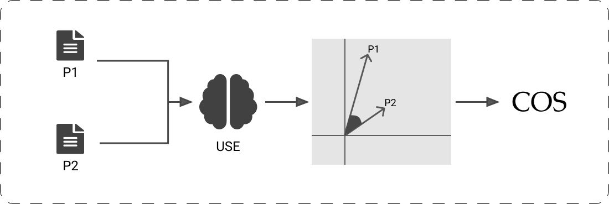

﷽

How To Choose The Right Embedding Model For You

Work done by **Mehdi CHEBBAH**

----

Embedding is a very famous task in NLP that means transforming the text from its natural format (Words and letters) to a format that could be used in ML/DL algorithms (Because these algorithms use numbers as inputs and outputs).

In this blog article, we will do a brief comparison between some Text Embedding methods. and learn how to decide which Embedding method is the best for our use case. Then we will be describing a small use-case of text embeddings (A Textual Similarity Calculator).

# Comparison Criteria

We could find in the literature lot of options for this task. In this article, I’ve made a comparison between some well-known Embedding methods. This comparison is based on some criteria that I judged important to decide what approach to use depending on your use case. For instance:

**Embeds**: This criterion explains the level where the algorithm operates. It has 4 possible values:

+ *Character N-grams*: The algorithm operates on the characters’ level. This means that it takes a sequence of N characters as an input. This will allow the algorithm to learn not only the words in the corpus but also words out of vocabulary that could be derived from other words by taking only N chars of the word (For example in a 3-gram model: boyfriend –> boy, oyf, yfr, fri, rie, ien, end)
+ *Words*: The algorithm operates on the words level. This means that it learns the representation of words. This is useful in cases where we are trying to embed a few words, or if we are comparing them, or looking for synonyms, or other tasks related to words. But this type of embeddings could also be used to represent sentences, thanks to the characteristics of word vectors that hold information other than the meaning of the word. For example, if we take the embeddings of these words: King, Man, Woman, Queen we could Note that King — Man + Woman = Queen. This means that we could represent a sentence using the sum of word embeddings that compose this sentence.
+ *Sub-words*: The algorithm operates on the sub-words level. This type was invented to overcome the out-of-vocabulary problem while not being too fine-grained and get all the N-Grams. (For example: Because –> Because, cause, use OR boyfriend –> Boyfriend, boy, friend, end).
+ *Sentences*: The algorithm operates on sentences level. This will allow the algorithm not only to learn words, but also it allows to learn the context. This means a better understanding of the semantic of sentences.

**Type**: This criterion is available only for Words and sub-words operating levels. It has two modalities that have these meanings:

+ *Static*: If the embedding is static, that means that the model doesn’t take in consideration the context of the words. In other words, if the same word appeared in two different contexts it has the same vector. For example the word “Sort” in “I know the **sort** of people you’re mixing with” has the same representation as in “You have to **sort** the array”.
+ *Dynamic*: The representation of the word -here- depends on the context (i.e If the same word appears in two different contexts it will have two different vector representations).

**Pre-trained**: This criterion indicates if the technique has pre-trained models that could be used directly or need a small fine-tuning before it can be used. If you choose to use a pre-trained model, that means that you don’t have to re-train a new one, this will save you a lot of time to focus on some other tasks in your business process.

**DL architecture**: This criterion indicates the Deep Learning architecture used to solve the problem. The majority of new techniques are using Deep Learning Transformers as they offer the best results so far.

**Developed by**: We mention here who invented the technique. And also the year of publication of it (In general recent methods are more accurate than old ones).

# Comparison

In the following Table and the paragraphs after I will explain in detail my comparison and mention the pros/cons of each technique.

| Method               |      Embeds       |  Type   |       Pre-trained        |       DL architecture       |               Developed by               |
| -------------------- | :---------------: | :-----: | :----------------------: | :-------------------------: | :--------------------------------------: |
| BOW                  |       Words       | Static  |            No            |              /              |              (Harris, 1954)              |
| TF-IDF               |       Words       | Static  |            No            |              /              |              (Jones, 1972)               |
| Word2Vec (CBOW)      |       Words       | Static  |         English          |             FNN             |     (Mikolov *et al.*, 2013)[Google]     |
| Word2Vec (Skip-gram) |       Words       | Static  |         English          |             FNN             |    (Mikolov *et al.*, 2013) [Google]     |
| GloVe                |       Words       | Static  |         English          |              /              |  (Pennington, Socher and Manning, 2014)  |
| Doc2Vec (Gensim)     |     Sentences     |    /    |         English          |             FNN             |     (Le and Mikolov, 2014) [Google]      |
| Skip-Thought         |     Sentences     |    /    |         English          |            LSTM             |          (Kiros *et al.*, 2015)          |
| Word2Vec (FastText)  | character n-grams |    /    |    Multiple languages    |             FNN             |    (Joulin *et al.*, 2016) [Facebook]    |
| USE                  |     Sentences     |    /    |         English          | Transformers / DAN Encoders |      (Cer *et al.*, 2018) [Google]       |
| InferSent            |     Sentences     |    /    |         English          |           biLSTM            |   (Conneau *et al.*, 2018) [Facebook]    |
| ELMo                 |       Words       | Dynamic |         English          |           biLSTM            |    (Peters *et al.*, 2018) [AllenNLP]    |
| BERT                 |     sub-words     | Dynamic |         English          | bidirectional Transformers  |     (Devlin *et al.*, 2019) [Google]     |
| SBERT                |     Sentences     |    /    |    Multiple languages    |        Transformers         |       (Reimers and Gurevych, 2019)       |
| SciBERT              |     Sub-words     | Dynamic |         English          | bidirectional Transformers  | (Beltagy, Lo and Cohan, 2019) [AllenNLP] |
| GPT-3                |     Sentences     |    /    | Multiple languages (API) |        Transformers         |     (Brown *et al.*, 2020) [OpenAI]      |

I started this comparison with the classical methods for calculating Embeddings, for instance: The **Bag Of Words** (**BOW**) and the **TF-IDF** approaches. These methods are very popular methods and very easy to implement. But they are too simple; Don’t work on a semantic level; Bad accuracy compared to other methods; Need to be fine-tuned then trained on the corpus (No pre-trained models).

I found next, the **Words to Vectors** (**Word2Vec**) model with its two variants (**CBOW** and **Skip-Gram**). Both the variants of Word2Vec are based on *Feed Forward Neural Networks* (*FNNs*), they differ only in the mission. While CBOW tries to predict a word given the surrounding words. The Skip-Gram model tries to predict the surrounding words given one word. This difference leads to a little change in the characteristics of the word vectors: For example, the CBOW is characterized by its speed while Skip-Gram gives good results for rare words. The downside of these models is that they don’t capture polysemy.

The next option is the **Global Vectors** model (**GloVe**) which is a *probabilistic model* based on global word-word co-occurrence statistics that learn static word representations from the corpus. This model is known for its ease of parallelization but it is also memory-intensive in the training phase. So If you are limited in resources (RAM and GPU), it is only useful if you use a pre-trained model.

My next option on the list is **Documents to vectors** (**Doc2Vec**). This method was proposed by Google, it uses a simple *Feed Forward Neural Network* (*FNN*) to calculate the embedding of a sentence directly. This model uses the same architecture as Word2Vec but with a little change that made a great improvement in understanding the sentences (Added a special token that holds the meaning of the sentence). An implementation is provided in the Gensim library with a pre-trained model for the English language. This model is better than the previously mentioned models in the document scale.

Another model that could accomplish the embedding task is **Skip-Thought** which is a simple *LSTM* model for learning fixed-length representations of sentences. This model is accurate in calculating the semantic similarity between sentences and for classification tasks. It is available also as a pre-trained model which made it a good choice for sentence embedding tasks.

The next option in this list is another implementation of **Word2Vec** model based on character N-Grams. It is available at the open-source library *FastText* developed by Facebook. This model is better than the other Word2Vec models as it is good in capturing rare or out-of-vocabulary words. It is also good to mention that lot of pre-trained models are available (Provided by Facebook) for English and for non-English text trained on Wikipedia data. But at a sentence level, it is worse than sentence-based models as it is based on N-Grams.

The **Universal Sentence Encoder** (or **USE** for short) is a very powerful model in this list. It has two variants that are both developed by Google: (I) The first one is using a *Transformer* architecture. This technique performs better at the cost of computation time as the network is trained on multiple tasks; (II) The second one is using *Deep Averaging Network (DAN)* which is way faster but less accurate than the first option. It is a great option for sentence embedding use-cases because: (1) Pre-trained models are available in Tensor-flow hub and well documented; (2) Very good accuracy in semantic textual similarity as it is trained for this task particularly. One downside for it is that the code is not published (If you want to train the model you have to code it) and there are missing technical details about the architecture used by the researchers who published it. But if you opt for using a pre-trained model, this will not be an issue for you.

The next model is developed by Facebook for sentence embeddings calculation. This model is called **InferSent**. It is based on *biLSTM* architecture and is available to download as a pre-trained model for the English language. It is designed for Natural Language Understanding (NLU) tasks, especially for sentence semantic similarity calculation.

Another option on the list is **Embeddings from Language Models** (**ELMo**) which is a word embedding model developed by AllenNLP. It is based on *biLSTM* architecture and is available as a pre-trained model for the English language. It is very good at calculating word representations depending on the context (Dynamic word representations). And it is very good at capturing the polysemy. But it is not sufficient for sentence embeddings.

The next option is a very popular and very powerful model that is called **BERT** (Stands for **Bidirectional Encoder Representations from Transformers**). It was developed by Google using bidirectional Transformers to learn dynamic representations for sub-words. It generates very accurate vectors for words. But it is designed for generating tasks (Natural Language Generation -NLG-). So this model is not adopted for language understanding use-cases but it was the basis for many other models that are useful for these tasks.

The next model is **Sentence BERT** (**SBERT**) which is based on *bidirectional Transformers*. This model is simply BERT designed for sentences. It has a very high accuracy for calculating the semantic textual similarity between paragraphs. There are a lot of pre-trained models in the literature that are based on this model (Using multiple datasets), some of them are specific for the English language, and the others are multilingual, some of them are adapted for NLG and others for NLI. So this model is adapted for multiple situations.

Another BERT-based model in this list is **Scientific BERT** (**SciBERT**) (Developed by AllenNLP). This option is just the BERT model trained on a very large dataset of English scientific papers. This model is very adapted for processing scientific information use-cases. As it could capture the meaning of scientific words and represent them well. But at the same time, it has critical issues for some other use-case. For instance: It is trained for generative tasks so don’t use it for understanding tasks; It is designed for word embeddings rather than sentences.

The next option is the state-of-the-art in multiple NLP tasks (NLG or NLU) till the day of writing these words. This model is called **Generative Pre-trained Transformer 3** (**GPT-3**). It is developed by the team of OpenAI using the *Transformers* architecture for embedding sentences. A pre-trained model exists and is available only through the official API offered by the team (Via the Internet). It outperforms all the other models in almost all NLP tasks. But it is not available for download. In fact, it could be used only as a black-box service. For that reason, if you don’t want to depend on the OpenAI enterprise in case they change the policy of use of the API you should not use it.

# A simple use-case for Embeddings 

We want here to implement a simple semantic textual similarity calculator. That compares two scientific articles using the abstracts. To accomplish this task, the most common way is to:

1. Build Text Embeddings
2. Calculate the distance between the vectors resulting from the previous step. This distance could be accomplished by calculating the distance using *Hamming Distance*, *Euclidean Distance*, *Manhattan Distance,* or *Minkowski Distance*. Also, it could be calculated using the *Cosine Similarity* measure which I’ll be using in this article.

So what we want here is an Embedding model that:

+ Is based on deep learning because they are more accurate.
+ Embeds Sentences not chars, nor words.
+ Has pre-trained models as we don’t want to train a new model if the quality of existing models is enough.
+ Has at least one implementation that could be used as we don’t want the article to be longer than it is.
+ Is designed for language understanding, not generation.

After eliminating methods that are not suitable for our use case, we are left with 4 options: **Skip-Thought**, **USE**, **InferSent,** and **SBERT**. The next step is to compare these models on the textual similarity task. To do so we have to search (On this website [PapersWithCode](https://paperswithcode.com/) for example) for the goodness of these models on the *STS Benchmark* (*Sentiment Textual Similarity Benchmark*) (The results are shown in the next Table) and we havSentimante found that the **USE** model with Transformers architecture gives the best results in this task.

| Model             |  STS-B   |
| ----------------- | :------: |
| Skip-Thought      |   0.75   |
| USE(Transformers) | **0.78** |
| USE(DAN)          |   0.76   |
| InferSent         |   0.77   |
| SBERT             |   0.77   |

After choosing the model, the second step is calculating the distance. As we mentioned earlier we will be using in this article the *Cosine Similarity* function. Our Semantic Textual Similarity Calculator will look something like this:

1. Get the abstracts of the two papers ($P_1$ and $P_2$).
2. Use the **USE** pre-trained model to generate the Embeddings of these papers. ($\overrightarrow{P_1}$ and $\overrightarrow{P_2}$)
3. Calculate the Cosine similarity between vectors of the two papers using this function $\cos(\angle (\overrightarrow{P_1}, \overrightarrow{P_2}))$

# Conclusion

We have seen in this article the importance of text embeddings in the field of NLP. We have learned how to choose a good model that fits our needs from all the models existing on the literature using a simple procedure which is:

1. Clearly identify your needs, using a series of specific questions.
2. Filter the list of all available Embedding methods based on your answers.
3. Compare the remaining methods based on a benchmark that focuses on your needs (Benchmark for semantic Similarity, Sentiment Analysis, Question Answering, Text Comprehension, …).

We have seen also a small demo on how to use Embeddings to calculate the semantic similarity between some scientific articles using the **USE** model and the *Cosine Similarity* function.

# References

+ Harris, Z.S. (1954) ‘Distributional structure’, *Word*, 10(2–3), pp. 146–162.
+ Jones, K.S. (1972) ‘A statistical interpretation of term specificity and its application in retrieval’, *Journal of documentation* [Preprint].
+ Mikolov, T. *et al.* (2013) ‘Efficient Estimation of Word Representations in Vector Space’, *arXiv:1301.3781 [cs]* [Preprint]. Available at: http://arxiv.org/abs/1301.3781 (Accessed: 23 May 2021).
+ Pennington, J., Socher, R. and Manning, C. (2014) ‘Glove: Global Vectors for Word Representation’, in *Proceedings of the 2014 Conference on Empirical Methods in Natural Language Processing (EMNLP)*. *Proceedings of the 2014 Conference on Empirical Methods in Natural Language Processing (EMNLP)*, Doha, Qatar: Association for Computational Linguistics, pp. 1532–1543. doi:[10.3115/v1/D14-1162](https://doi.org/10.3115/v1/D14-1162).
+ Le, Q.V. and Mikolov, T. (2014) ‘Distributed Representations of Sentences and Documents’, *arXiv:1405.4053 [cs]* [Preprint]. Available at: http://arxiv.org/abs/1405.4053 (Accessed: 23 May 2021).
+ Kiros, R. *et al.* (2015) ‘Skip-Thought Vectors’, *arXiv:1506.06726 [cs]* [Preprint]. Available at: http://arxiv.org/abs/1506.06726 (Accessed: 18 August 2021).
+ Joulin, A. *et al.* (2016) ‘Bag of Tricks for Efficient Text Classification’, *arXiv:1607.01759 [cs]* [Preprint]. Available at: http://arxiv.org/abs/1607.01759 (Accessed: 23 May 2021).
+ Cer, D. *et al.* (2018) ‘Universal Sentence Encoder’, *arXiv:1803.11175 [cs]* [Preprint]. Available at: http://arxiv.org/abs/1803.11175 (Accessed: 18 May 2021).
+ Conneau, A. *et al.* (2018) ‘Supervised Learning of Universal Sentence Representations from Natural Language Inference Data’, *arXiv:1705.02364 [cs]* [Preprint]. Available at: http://arxiv.org/abs/1705.02364 (Accessed: 23 May 2021).
+ Peters, M.E. *et al.* (2018) ‘Deep contextualized word representations’, *arXiv:1802.05365 [cs]* [Preprint]. Available at: http://arxiv.org/abs/1802.05365 (Accessed: 23 May 2021).
+ Devlin, J. *et al.* (2019) ‘BERT: Pre-training of Deep Bidirectional Transformers for Language Understanding’, *arXiv:1810.04805 [cs]* [Preprint]. Available at: http://arxiv.org/abs/1810.04805 (Accessed: 23 May 2021).
+ Reimers, N. and Gurevych, I. (2019) ‘Sentence-BERT: Sentence Embeddings using Siamese BERT-Networks’, *arXiv:1908.10084 [cs]* [Preprint]. Available at: http://arxiv.org/abs/1908.10084 (Accessed: 21 March 2021).
+ Beltagy, I., Lo, K. and Cohan, A. (2019) ‘SciBERT: A Pretrained Language Model for Scientific Text’, *arXiv:1903.10676 [cs]* [Preprint]. Available at: http://arxiv.org/abs/1903.10676 (Accessed: 23 May 2021).
+ Brown, T.B. *et al.* (2020) ‘Language Models are Few-Shot Learners’, *arXiv:2005.14165 [cs]* [Preprint]. Available at: http://arxiv.org/abs/2005.14165 (Accessed: 23 May 2021).