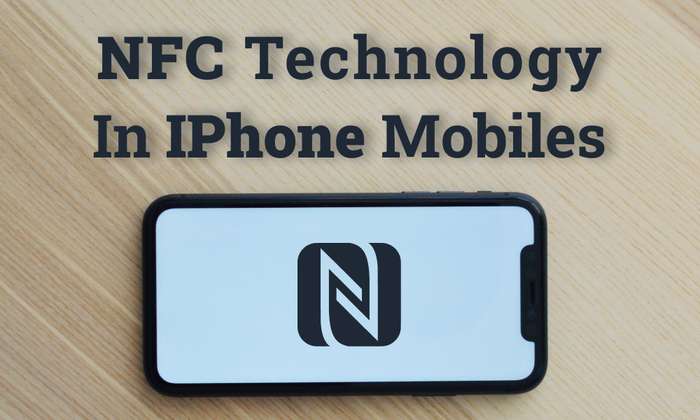

?

NFC In iPhone Mobiles

Written by **Mehdi CHEBBAH**

---

<h3>Table of Contents</h3>

[TOC]

---

If you are interested in IT news, you have probably heard people talking about NFC in the last few years, as it is a popular technology that is used everywhere from headsets, to file sharing, to payment devices and lot of other use cases. You may be wondering now, what is this NFC technology? how does it works? what is it used for? and if you are an iPhone fan (just like me) what iPhone devices that support this technology? and how to use it? In the following we will try to answer these questions!

So let get straight into it :point_down:

# What is NFC ?

**Near Field Communication** or **NFC** in short, is a proximity-based wireless communication standard.   It enables communication between two electronic devices over a distance of 10 cm or less. You can find NFC  technology on smartphones, tablets, speakers, gaming consoles, payment systems, and many other devices.

NFC devices work on one of the three following modes:

+ *Card Emulation*: NFC is used to emulate smart cards on devices such as smartphones, allowing users to perform transaction using their phones directly (No need to use cards).
+ *Reader/Writer*: NFC is used to read from and write to NFC tags, allowing users to easily share data.
+ *Peer-to-Peer*: NFC is also used to exchange information between two devices in an ad-hoc manner.

# How does NFC works ?

|  |
| :----------------------------------------------------------: |
| How does NFC works [[Source](https://www.microcontrollertips.com/programming-automation-using-nfc-tags-faq/)] |

NFC is based on RFID (Radio Frequency Identification) technology, that has already been around for decades, it’s the technology used to allow you to access an office building or hotel room using a key card.

NFC works as follows:

1. The reader device generate a magnetic field by passing an electric current through a coil. 
2. When a tag (with its own coil) is brought nearby, the field induces an electric current within the tag  -without any wires or physical contact-. 
3. Once the initial handshake is complete, any stored data on the tag is wirelessly transmitted to the reader.

Another noteworthy point is that NFC devices can act as either a reader or tag. This bidirectional capability allows users to use their NFC devices in the three modes.

The following table shows you the features offered by the NFC technology:

| Features                       | NFC Support                                 |
| :----------------------------- | :------------------------------------------ |
| RF Carrier Frequency           | 13.56 MHz                                   |
| Distance                       | less than 10 cm                             |
| Data Rate                      | 106 or 212 or 424 Kbps                      |
| NFC Network Devices            | Tags and Readers                            |
| Network configuration          | peer to peer                                |
| NFC Network Device Modes       | Card Emulation, Reader/Writer, Peer-to-Peer |
| connection establishment time  | <0.1 sec                                    |
| Data Coding Schemes            | NRZ-L, Manchester, Modified Miller          |
| Data Modulation Schemes        | ASK, BPSK                                   |
| Collision mechanism (i.e. MAC) | Anti-collision support                      |
| NFC Standards                  | ISO 14443A/B, ISO 18092, JIS X6319-4        |

# What is NFC used for ? 

NFC has a wide rang of use-cases, here are few of them:

+ **Mobile payments**: Samsung Pay, Google Pay, and Apple Pay all use your smartphone's NFC chip for contactless payments. Most debit and credit cards these days already have an NFC tag built-in.
+ **Bootstrapping other connections**: NFC offers a low-speed connection with simple setup that can be used to bootstrap more capable wireless connections. For example, Nokia, Samsung, BlackBerry and Sony have used NFC technology to pair Bluetooth headsets, media players and speakers with one tap. The same principle can be applied to the configuration of Wi-Fi networks.
+ **Data transfer**: NFC can be used for sharing contacts, text messages or links.
+ **Identity and access tokens**: NFC-enabled devices can act as electronic identity documents found in Passports and ID cards.
+ **Smartphone automation**: Reading NFC tags using a smartphone can allow a change of phone settings, texting, app launching, or command execution.
+ **Gaming**: Nintendo for example uses the technology to connect physical toys with video games. 
+ **Home automation**: Some smart home platforms, including Home Assistant and Apple’s HomeKit, use NFC tags to control devices or automation.

# iPhones and NFC

Apple started including a NFC chip in its iPhone phones in 2014 starting form **iPhone 6** which was the Apple’s first released phone that supports NFC. The following table summarizes NFC support in all iPhone phones [[Source](https://www.digitalcitizen.life/iphone-nfc/)]:

| iPhone                         | NFC chip | Apple Pay NFC support | Read NFC tags | Write NFC tags | Read NFC in Background |
| ------------------------------ | :------: | :-------------------: | :-----------: | :------------: | :--------------------: |
| 13, 13 Pro / Max, 13 Mini      |    :heavy_check_mark:    |           :heavy_check_mark:           |       :heavy_check_mark:       | :heavy_check_mark: |    :heavy_check_mark: |
| 12, 12 Pro / Max, 12 Mini      |    :heavy_check_mark:    |           :heavy_check_mark:           |       :heavy_check_mark:       |       :heavy_check_mark:       |           :heavy_check_mark:           |
| 11, 11 Pro / Max, SE (2nd Gen) |    :heavy_check_mark:    |           :heavy_check_mark:           |       :heavy_check_mark:       |       :heavy_check_mark:       |           :heavy_check_mark:           |
| XS, XS Max, XR                 |    :heavy_check_mark:    |           :heavy_check_mark:           |       :heavy_check_mark:       |       :heavy_check_mark:       |           :heavy_check_mark:           |
| X, 8, 8+,7 ,7+                 |    :heavy_check_mark:    |           :heavy_check_mark:           |       :heavy_check_mark:       |       :heavy_check_mark:       |           :heavy_multiplication_x:           |
| 6, 6+, 6S, 6S+, SE (1st Gen)   |    :heavy_check_mark:    |           :heavy_check_mark:           |       :heavy_check_mark:       |       :heavy_multiplication_x:       |           :heavy_multiplication_x:           |
| 5S, 5C, 5, 4S, 4, 3GS, 3G      |    :heavy_multiplication_x:    |           :heavy_multiplication_x:           |       :heavy_multiplication_x:       |       :heavy_multiplication_x:       |           :heavy_multiplication_x:           |



By the way, all iPhone phones that are using iOS 14 or newer and have NFC support, automatically read all kinds of NFC tags without needing third-party apps, including web addresses (URLs), emails, phone numbers, and SMS messages.

# How to use NFC on iPhone 11 ?

Let’s suppose you have an iPhone 11, we know now that it supports NFC, not only that but it supports NFC in the background, what does this means ? This means that you don’t need to activate anything before using it, cool isn’t it! Here is how to use it:

+ For Peer-to-Peer communication, all you have to do is to tap your iPhone to another device that's NFC-enabled.
+ To read an NFC tag, you simply hold the top back of your iPhone close to the NFC tag, it'll read it and show a notification on the screen.

For example, if you tap your iPhone 11 to a NFC-enabled Bluetooth device it will show you a notification asking you to peer the two devices, you can choose an action right from the notification. Another example could be if you read a NFC tag containing a URL using your iPhone 11, a notification will show up asking you if you want to follow the URL, Just as simple as that! 

Here is a 90 sec video that shows you how to use NFC in iPhone 11:

<iframe width="560" height="450" src="https://www.youtube.com/embed/knpIEdqIhFo" title="YouTube video player" frameborder="0" allow="accelerometer; autoplay; clipboard-write; encrypted-media; gyroscope; picture-in-picture" allowfullscreen></iframe>

# Conclusion

In the previous few sentences, you learned the basics of NFC and how to use it on iPhone 11. If you are interested in learning more about it or want to know how to use it in other devices, you can read the following articles: 

+ https://en.wikipedia.org/wiki/Near-field_communication
+ https://www.androidauthority.com/what-is-nfc-270730/
+ https://www.digitalcitizen.life/iphone-nfc/
+ https://seritag.com/learn/nfc-enabled-phones/apple-iphone-11
+ https://iotpoint.wordpress.com/nfc-tutorial/

What do you think about this technology? please share with us your thoughts through the comments section.  