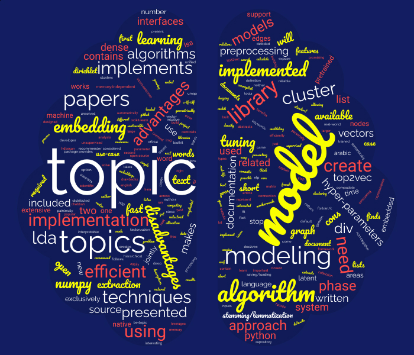

﷽

Topic Modeling Libraries

Written by **CHEBBAH Mehdi**

---

*Topic modeling* (or *topic extraction*) is a technique in Natural Language Processing (NLP) that allows the machine to automatically extract meaning from text by identifying recurrent abstract themes or topics, represented generally by the most relevant keywords.

In this article I’ll be presenting some interesting libraries that implement different topic extraction techniques, I’ll explain the implemented techniques and the advantages and disadvantages of each implementation. Then I’ll present a use-case of topic modeling in real-life.

## [Scikit-learn](https://scikit-learn.org/)

The first library on our list is *Scikit-learn* which is an open-source machine learning library that supports *supervised* and *unsupervised* learning. This library implements two Topic modeling algorithms: **Latent Dirichlet Allocation (LDA)** and **Non-negative Matrix Factorization (NMF)**. The pros and cons of this implementation to the algorithms are presented here:

+ **Advantages**

  + Extensive documentation.
  + Intuitive interfaces.
  + Very popular.
  + Open-source.

+ **Disadvantages**

  + Preprocessing phase not included (This phase should be implemented by the developer).
  + The need for hyper-parameters tuning (Parameter tuning is time and resources consuming).
  + No native support for saving/loading the model. In fact, there are workarounds but they are not reliable in the case of large models.
  + Not efficient with a short text.

## [Gensim](https://radimrehurek.com/gensim/apiref.html)

*Gensim* is a free open-source Python library for representing documents as semantic vectors, as efficiently and painlessly as possible. This library implements three topic extraction techniques: **LDA**, **Latent Semantic Analysis** (**LSA**), and **Hierarchical Dirichlet Process (HDP)**. The advantages and disadvantages are presented here:

+ **Advantages**

  + Memory-independent (Datasets larger than the available RAM could be loaded in batch mode to the algorithm).
  + Intuitive interfaces.
  + Distributed computing (The algorithm could be run on a cluster).
  + Extensive documentation.
  + Implemented in Fortran/C (Fast).
  + Open-source.

+ **Disadvantages**

  + Preprocessing phase not included.
  + The need for hyper-parameters tuning.
  + Not efficient with a short text.

## [Numpy ML](https://numpy-ml.readthedocs.io/en/latest/)

The next option is *Numpy ML* which is a growing collection of machine learning models, algorithms, and tools written exclusively in *NumPy* and the Python *standard library*. The only topic modeling algorithm implemented in this library is **LDA**. This implementation has its features and inconveniences:

+ **Advantages**

  + Implemented exclusively in *NumPy* which makes it fast and compatible with data types used in the library.

+ **Disadvantages**

  + Preprocessing phase not included.
  + The need for hyper-parameters tuning.
  + No native support for saving/loading the model.
  + Not efficient with a short text

## [Familia](https://github.com/baidu/Familia)

*Familia* is an open-source project. A Toolkit for Industrial Topic Modeling. It implements **LDA** and **SentenceLDA**. Here are the pros and the cons:

+ **Advantages**

    + Industrial oriented

+ **Disadvantages**

    + No documentation is available (Neither in English nor in French, nor Arabic).

## [Top2vec](https://top2vec.readthedocs.io/en/latest/)

*Top2Vec* is a python library designed to learn jointly embedded topics, documents, and word vectors. It is the only implementation of the **Top2Vec** algorithm presented in [this paper](https://arxiv.org/abs/2008.09470). It is a promising approach that uses techniques of Deep Learning to solve this problem. Here are the benefits and drawbacks of this approach:

+ **Advantages**

  + Automatically finds the number of topics.
  + No stop word lists are required.
  + No need for stemming/lemmatization.
  + Works on short text.
  + Creates jointly embedded topics, documents, and word vectors.
  + Has search functions built-in.
  + Contains pretrained Embedding models (Doc2Vec, USE, or SBERT).

+ **Disadvantages**

  + A complicated approach.

## [BERTopic](https://maartengr.github.io/BERTopic/index.html)

This library implements the **BERTopic** model (presented in [this paper](https://zenodo.org/record/5574296)) which leverages *the BERT* model and Class-based TF-IDF (*c-TF-IDF)* to create dense clusters allowing for easily interpretable topics while keeping important words in the topic descriptions. This model has a lot of features that make it the best model in this list but at the same time has its own drawbacks that make you think before using it.

+ **Advantages**

  + Contains pretrained Embedding models (BERT model by default but any Embedding model could be used).
  + Automatically finds the number of topics.
  + No stop word lists are required.
  + No need for stemming/lemmatization.
  + Works on short text.

+ **Disadvantages**

  + A complicated approach.
  + The library contains some unsolved issues in its official Github repository.

## [Text2vec](http://text2vec.org/)

*text2vec* is an R package that provides an efficient framework with a concise API for text analysis and natural language processing (NLP). This library implements the **LDA** and **LSA** algorithms. The pros and cons of this implementation are presented below:

+ **Advantages**

  + Is written in C++ (Fast).
  + expose unified interfaces (Easy to use).
  + Memory efficient.

+ **Disadvantages**

  + Available only in R language.

# Real-Life Use-Case Of Topic Modeling

One use-case that I personally come across is when we were building a new Recommender System for scientific papers. This system was based on a graph where papers, authors, and **topics** are nodes, and relations between them are edges. And it functions as follows:

+ If a paper is related to a topic we create a connection between the two.
+ If an author is interested in a topic we create a connection between the two.
+ We recommend to authors papers that are related to the topics that they are interested in.

To implement this system we have to use a topic modeling model that extracts the topics from papers. Then use these topics to build the graph. We decided to go with **Top2Vec** to accomplish this task, and here is how we used it:

1. First, the model takes the inputs (which are the abstracts of papers) and Embeds them using the Embedding model (The **USE** model in our case but any embedding model will fit here).
2. The second step is to reduce the dimensionality of the Embeddings space using the **UMAP** algorithm to create dense areas. These dense areas contain geometrically close words (Semantically close Words).
3. Cluster the results using a density-based clustering algorithm (The **HDBSCAN** is used here). Then calculate the centroids of each cluster (These centroids are considered as the representative vector of the topic).
4. Get the K closest words to the center of each cluster using the **K-NN** algorithm (These words represent the keywords of each topic). The outputs of this model are the list of topics and keywords (that will be used to create the graph nodes and edges related to topics) and the trained model (that will be used later to cluster new papers into the right topic).

This was just one simple real-world use-case of topic modeling techniques that I have personally faced. There are tons of other use-cases that every NLP engineer would face at least once in his career. 

#### Thank you for your reading

If you are interested in topic modeling algorithms in-depth you could read these papers:

+ Top2Vec: https://arxiv.org/abs/2008.09470
+ LDA: https://en.wikipedia.org/wiki/Latent_Dirichlet_allocation
+ LSA: https://en.wikipedia.org/wiki/Latent_semantic_analysis
+ BERTopic: https://maartengr.github.io/BERTopic/index.html
+ Top2Vec: https://github.com/ddangelov/Top2Vec
+ HDP: https://en.wikipedia.org/wiki/Hierarchical_Dirichlet_process